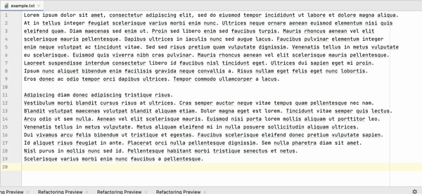

# Huffman encoding
Java libraries for compressing and decompressing files and images using Huffman encoding and i/o streams for compressed data storage

*HuffmanEncodingEC* includes methods to decompress and compress files. To compress a file use `compress(fileName)`, to decompress use `decompress(fileName)`.